# Flowchart

### A node (default)
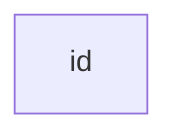
## Node Shapes

### A node with text

### A node with round edges
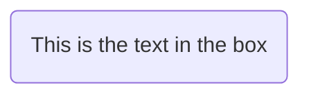
### A stadium-shaped node
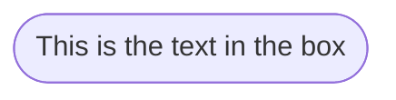
### A node in a subroutine shape
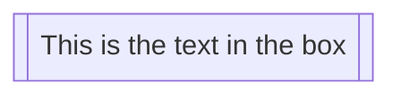
### A node in a cylindrical shape
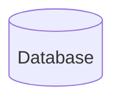
### A node in the form of a circle
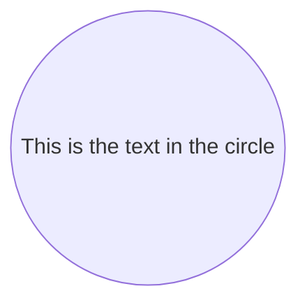
### A node in an asymetric shape
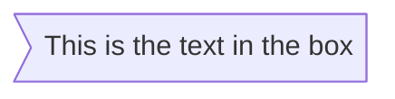
### A node (rhombus)
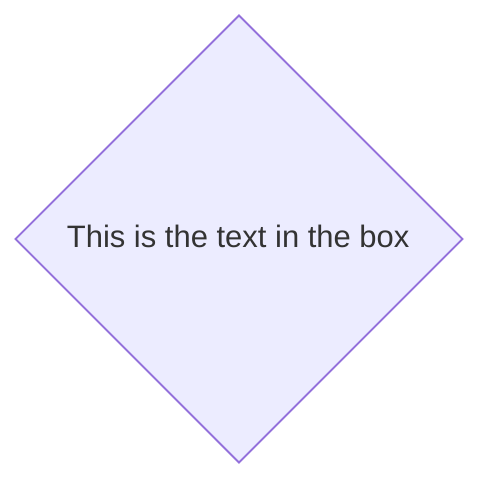
### A hexagon node

### Parallelogram
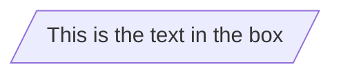
### Parallelogram alt
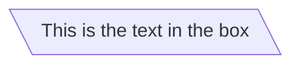
### Trapezoid
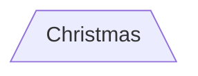
### Trapezoid alt
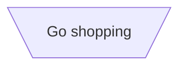

## Links between nodes
### A link with arrow head
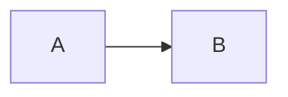
### An open link
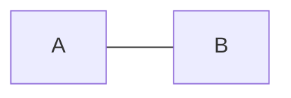
### Text on links
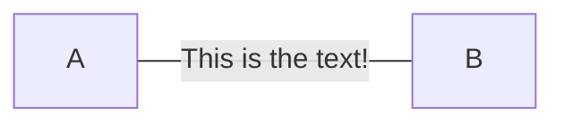
or
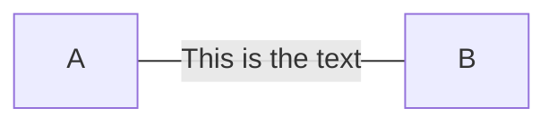
### A link with arrow head and text
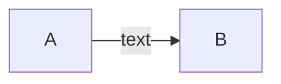

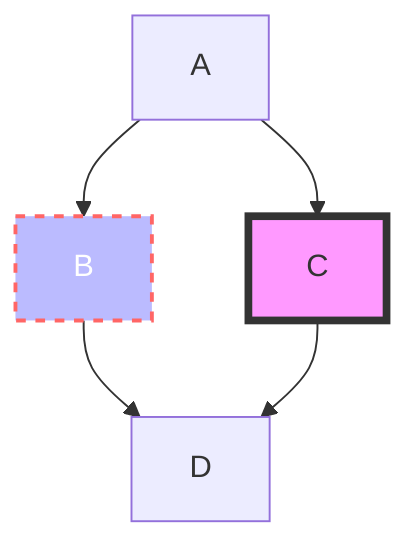