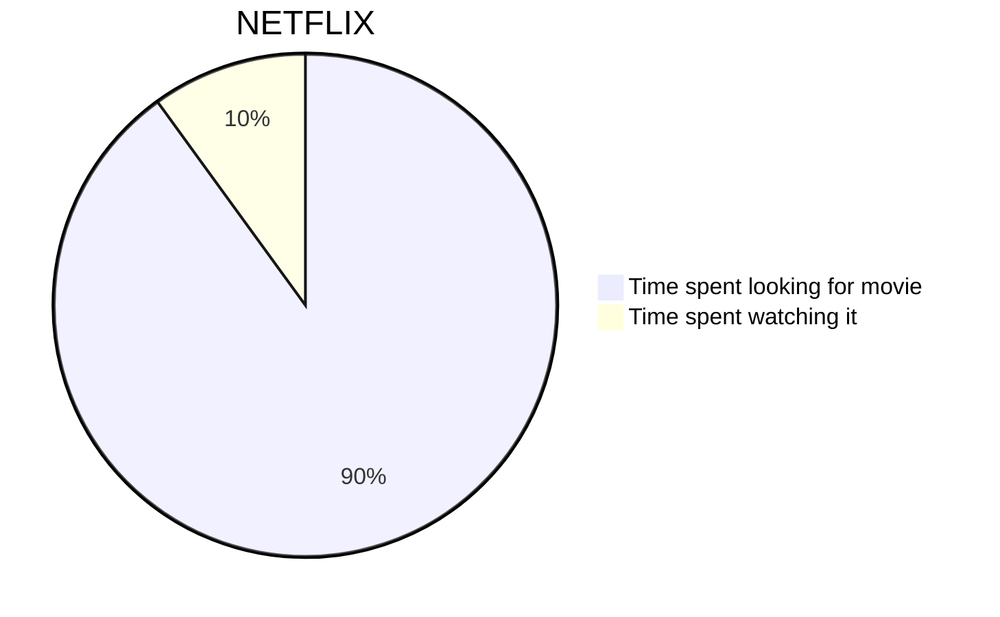
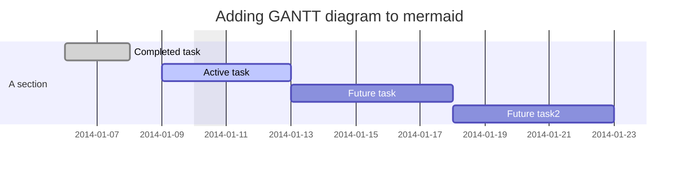
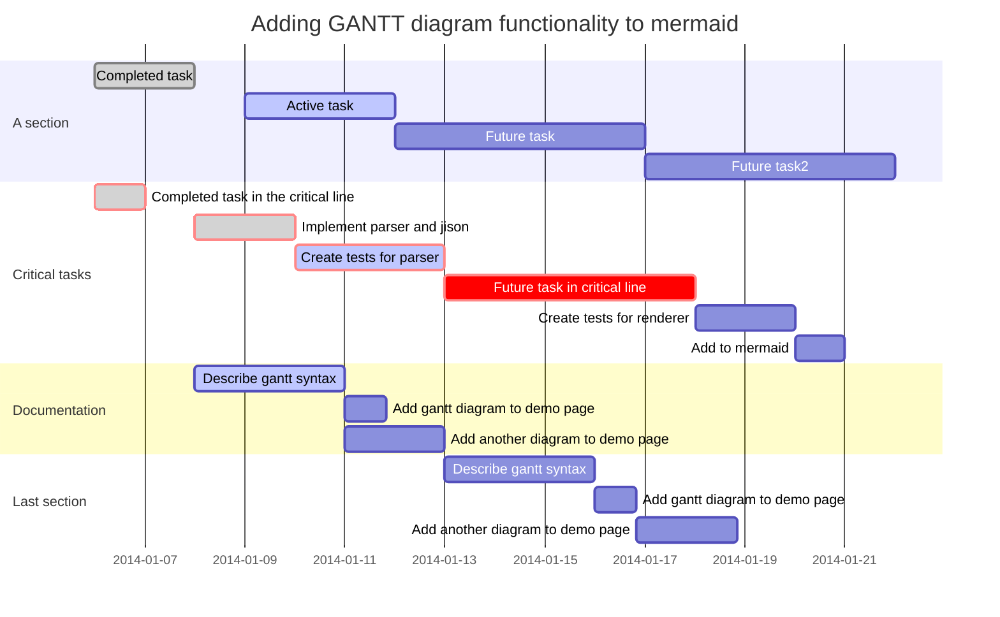
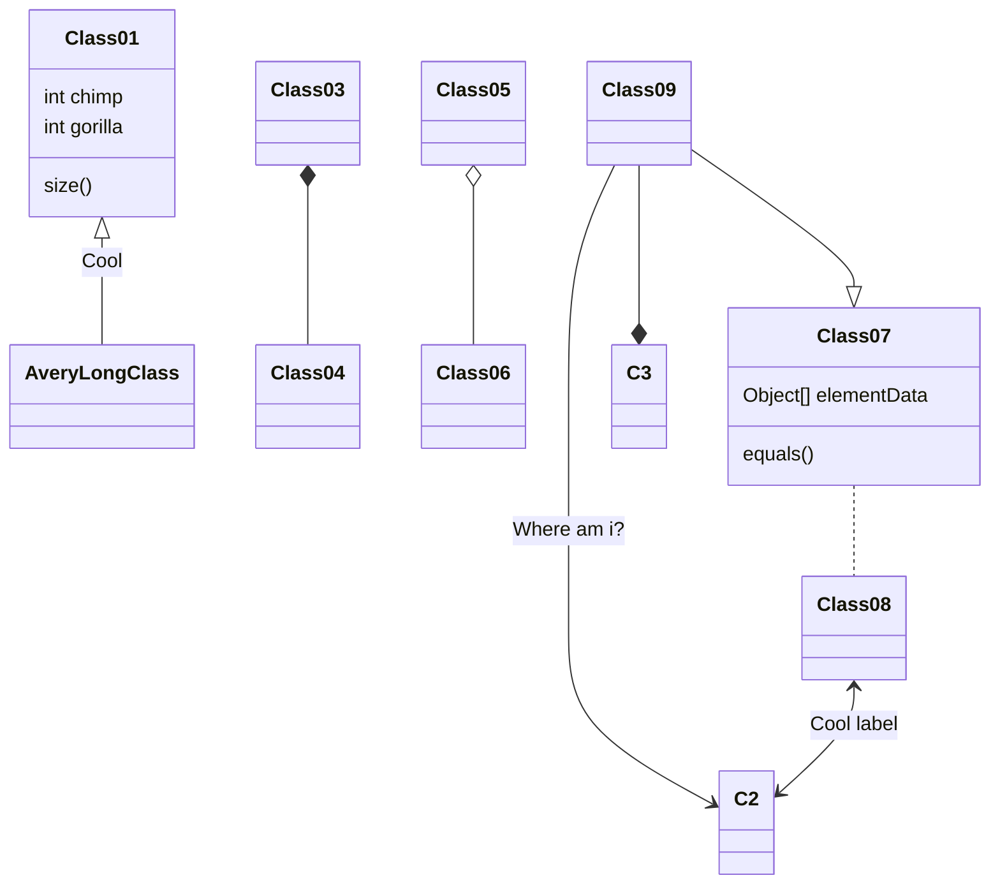
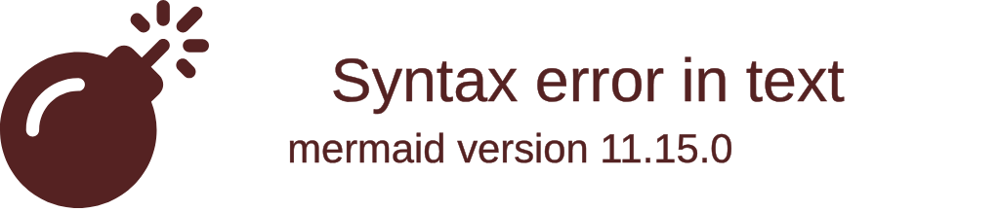
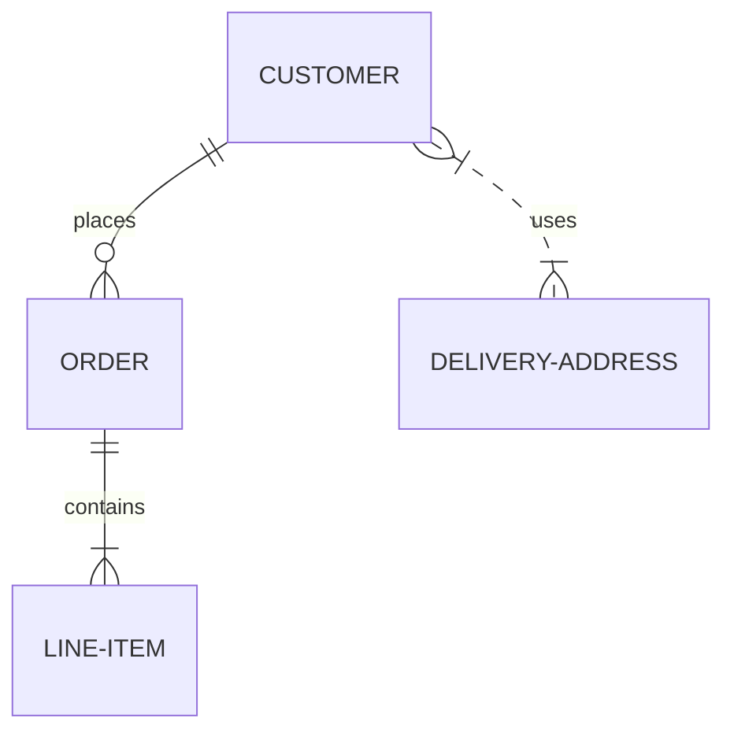
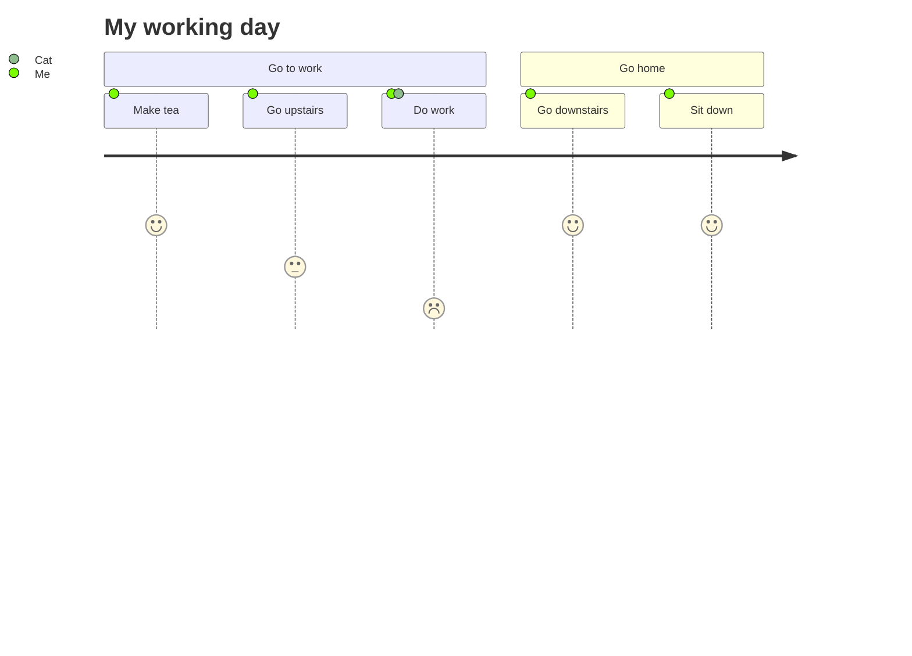

docker build -t mermaidjs/mermaid-live-editor https://github.com/mermaidjs/mermaid-live-editor.git

docker run -d -p 8000:8000 mermaidjs/mermaid-live-editor

<script src="mermaid.min.js">

</script>

# Pie Chart



# Gantt diagram



/*
    
    
​```
*/

# Teste

# Class diagram - :exclamation: experimental


# Git graph - :exclamation: experimental



# Entity Relationship Diagram - :exclamation: experimental


# User Journey Diagram
