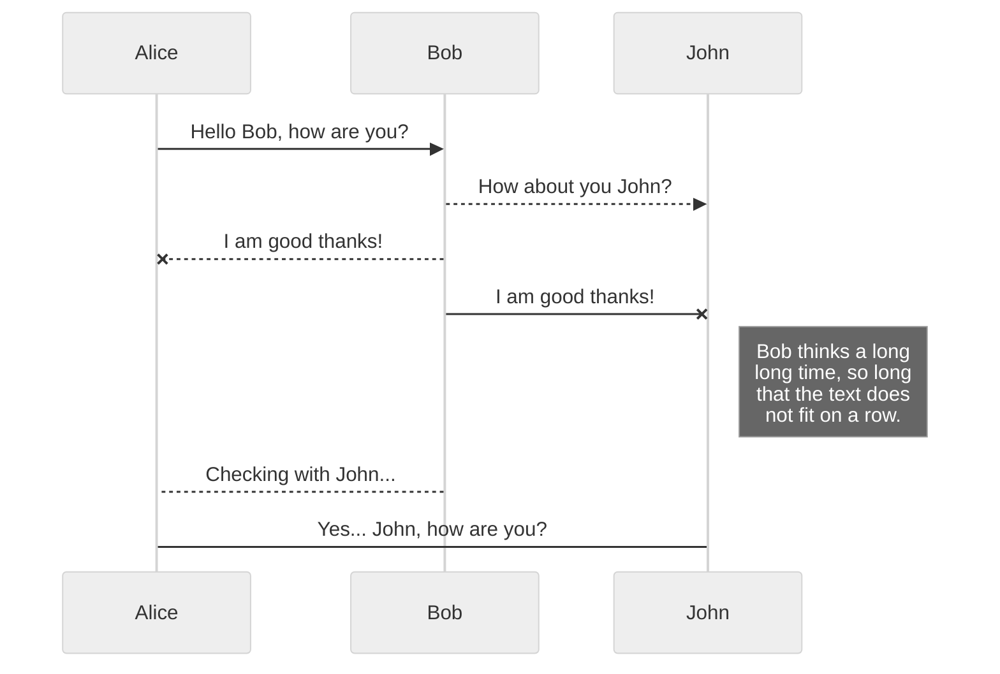
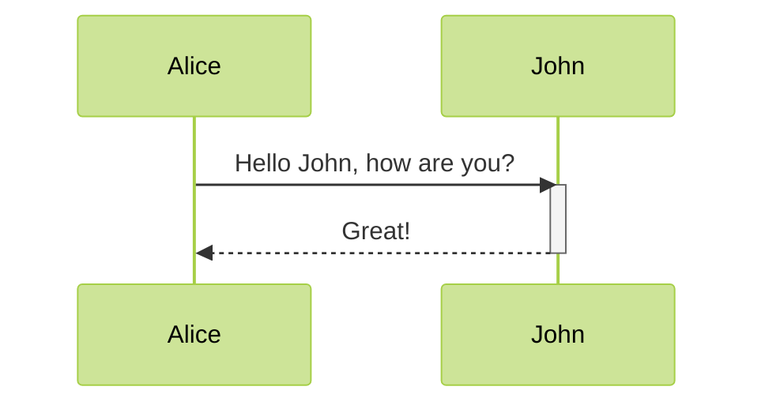
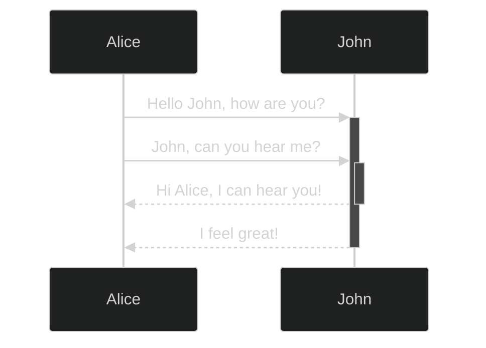

# Sequence Diagram

```mermaid
%%{ 
    init: { 
        'theme': 'neutral', 
        'themeVariables': { 
            'primaryColor': '#ff0000'
        }
    }
}%%
sequenceDiagram
    Alice ->> Bob: Hello Bob, how are you?
    Bob-->>John: How about you John?
    Bob--x Alice: I am good thanks!
    Bob-x John: I am good thanks!
    Note right of John: Bob thinks a long<br/>long time, so long<br/>that the text does<br/>not fit on a row.

    Bob-->Alice: Checking with John...
    Alice->John: Yes... John, how are you?
```

```mermaid
%%{ 
    init: { 
        'theme': 'forest', 
        'themeVariables': { 
            'primaryColor': '#ff0000'
        }
    }
}%%
sequenceDiagram
    Alice->>John: Hello John, how are you?
    activate John
    John-->>Alice: Great!
    deactivate John
```

```mermaid
%%{ 
    init: { 
        'theme': 'dark'
    }
}%%
sequenceDiagram
    Alice->>+John: Hello John, how are you?
    Alice->>+John: John, can you hear me?
    John-->>-Alice: Hi Alice, I can hear you!
    John-->>-Alice: I feel great!
```

